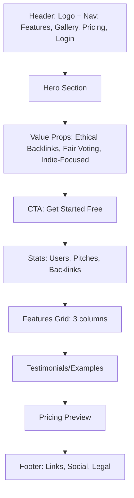
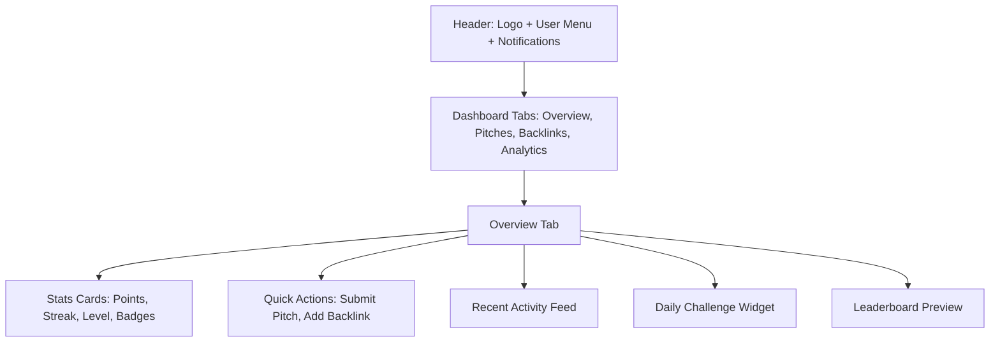
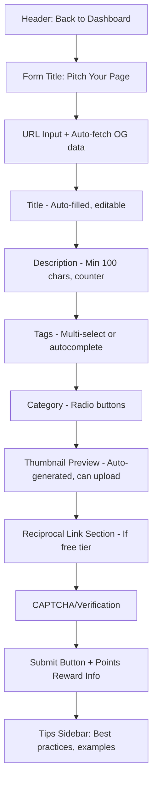
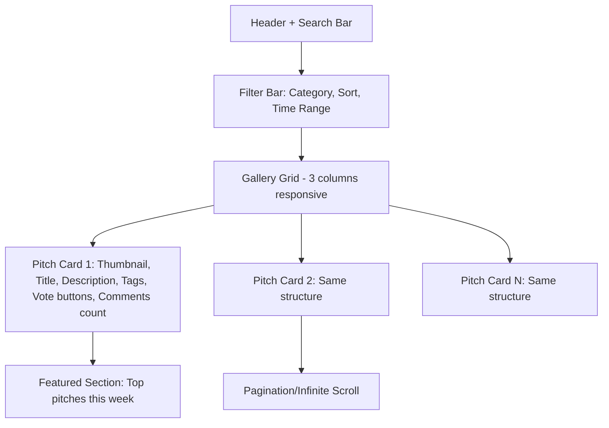
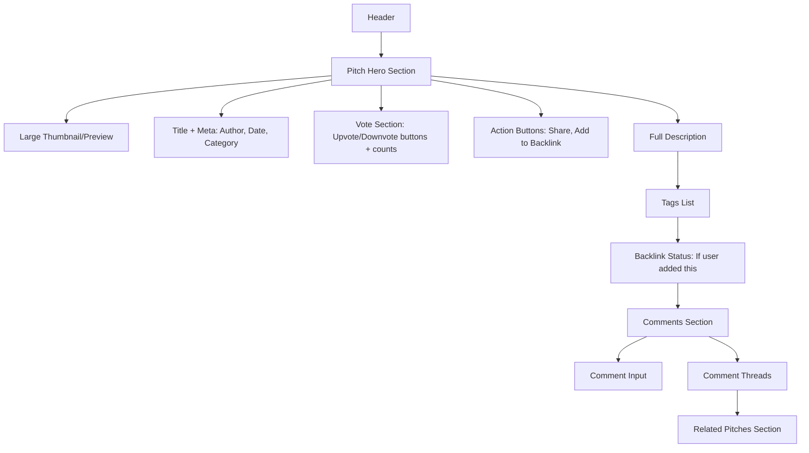
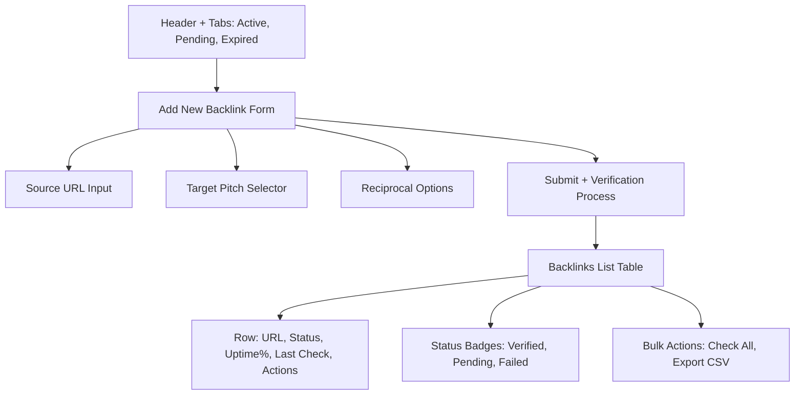
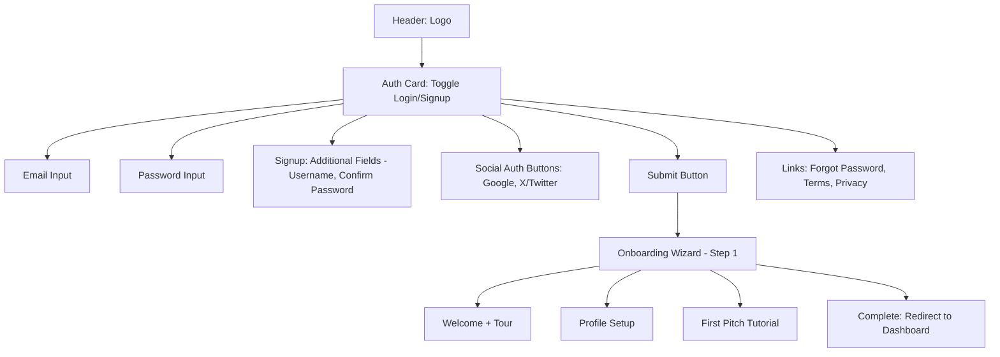
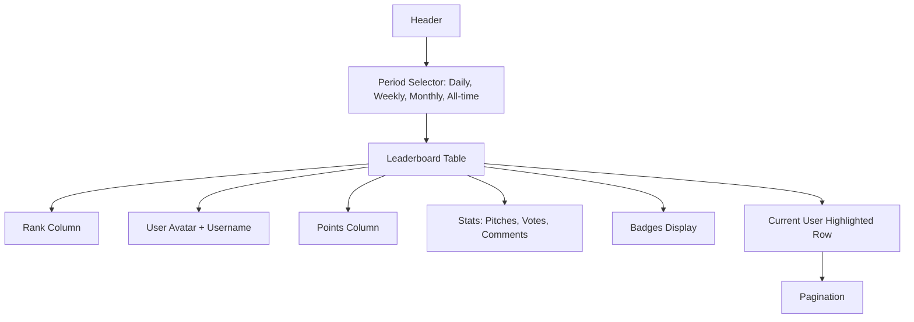

# Pitch My Page - Wireframes & UI Structure

## Wireframe Diagrams (Mermaid)

### 1. Landing Page



**Key Elements:**
- Hero: "The Fairer Product Hunt for Indie Creators"
- Value props: Free reciprocal backlinks, Anti-bot voting, Ethical SEO boost
- Social proof: User count, active pitches, verified backlinks
- Clear CTA: "Start Pitching Free" button

### 2. Dashboard



**Key Elements:**
- Gamification sidebar: Points balance, level progress bar, active streak
- Quick stats: Total pitches, active backlinks, total votes received
- Activity timeline: Recent votes, comments, achievements
- Challenge card: "Vote on 5 pitches today" + progress + reward

### 3. Submission Form



**Key Elements:**
- Real-time validation with helpful error messages
- Preview card showing how pitch will appear
- Points reward display: "You'll earn 10 points for this submission"
- Bulk upload option (for Plus/Power tiers): CSV upload button

### 4. Gallery/Search



**Pitch Card Structure:**
```
┌─────────────────────────┐
│  [Thumbnail Image]      │
│  Title (link)           │
│  Description (truncated)│
│  Tags: #ai #saas        │
│  👆 42  👇 2  💬 8      │
│  By @username • 2h ago  │
│  [View Details]         │
└─────────────────────────┘
```

**Key Elements:**
- Advanced search: Keywords, tags, category, date range
- Sort options: Newest, Most Voted, Trending, Underrepresented
- Fair exposure: "Indie Spotlight" section for smaller creators
- Voting: One vote per user, verified accounts only

### 5. Pitch Detail Page



**Key Elements:**
- Live voting with instant feedback
- Share buttons: Twitter, LinkedIn, direct link
- Backlink CTA: "Get a backlink for this pitch" (if user owns it)
- Related pitches: Similar tags/category
- SEO info: Domain authority, uptime if backlinked

### 6. Backlinks Management



**Table Columns:**
- Source URL (where link is placed)
- Target Pitch
- Type (dofollow/nofollow)
- Status (Verified/Pending/Failed)
- Uptime % (with trend indicator)
- Last Checked
- Actions (Edit, Remove, View Details)

### 7. Authentication (Login/Signup)



**Key Elements:**
- Single form component with mode toggle
- Social auth prominent (Google, X)
- Password strength indicator on signup
- GDPR consent checkbox
- Skip-able onboarding for returning users

### 8. Leaderboard



**Key Elements:**
- Top 3 get special highlighting/gold/silver/bronze
- Click username to view profile
- Filter by category/achievement type
- Export option for Power tier users

## Responsive Breakpoints

- Mobile: < 640px (single column, stacked cards)
- Tablet: 640px - 1024px (2 columns)
- Desktop: > 1024px (3 columns gallery, full sidebar)

## Design Principles

1. **Fairness First**: Prominent "Indie Spotlight" sections, transparent vote counts
2. **Trust Indicators**: Verification badges, uptime guarantees, anti-bot badges
3. **Gamification Visibility**: Points, badges, streaks always visible in header/nav
4. **Accessibility**: WCAG 2.1 AA compliant, keyboard navigation, screen reader support
5. **Dark Mode**: Toggle in header, respects system preference

